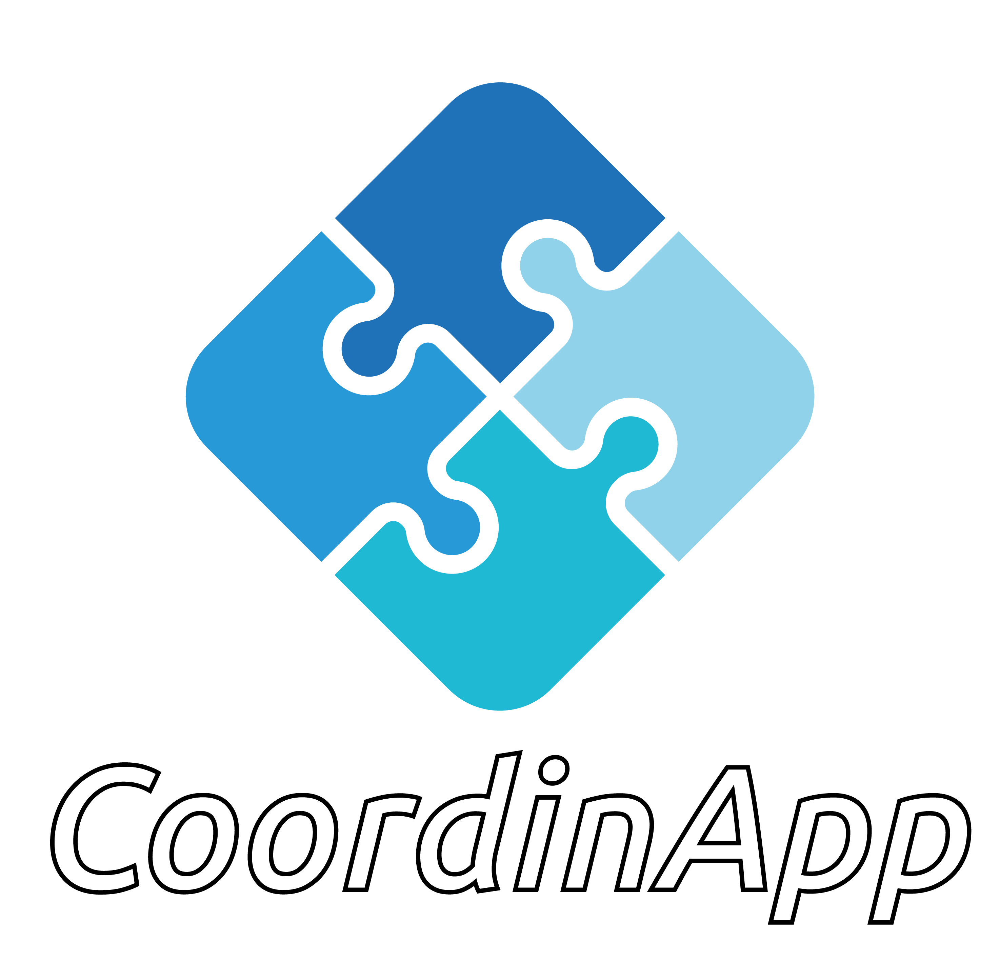
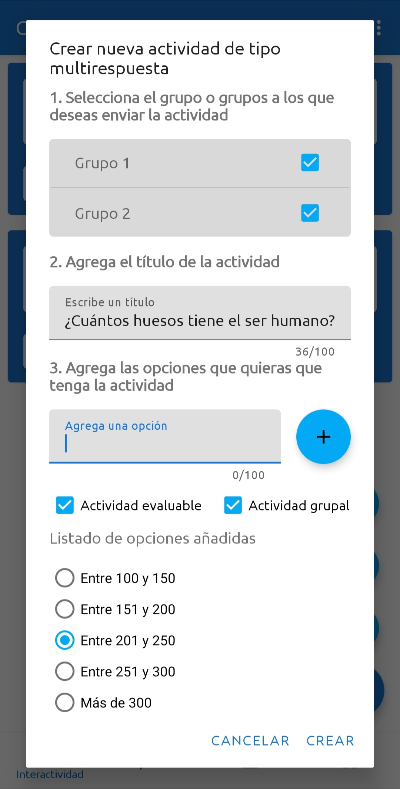

  
  

  
  
## About 📖
  
CoordinApp is an Android application in the form of a Virtual Learning Environment designed to connect teachers and students both inside and outside the classroom. It is created to encourage educators to implement advanced educational methodologies such as Cooperative Learning and gamification, which are supported by thousands of studies as some of the most effective approaches for students' personal development.  
  
CoordinApp is a nonprofit project aimed at reducing the technological gap experienced by families and promoting educational equality to the extent that mobile devices allow.  
  
CoordinApp is the outcome of in-depth academic research put into practice as an Android application, the most widely used mobile operating system on the market, with the goal of reaching as many users as possible.  
  
## Preview 🔎 
  
### Teacher app  

  
     

  

  
    

  
    

  
  
### Student app

  
     

  

  
     

  

## Features 💫

### Teacher app  

-   Integrated chat within groups, and individual chat with students
-   Selection of a spokesperson for the group
-   Uploading files and sending links in the chat
-   Three types of activities: Text input, multiple-choice, events
-   Review and assessment of activities both as a group and individually
-   Performance statistics both on a group and individual basis
-   Request for the creation of groups by students
-   Manual or automatic creation of groups: by manually selecting group members, by choosing the number of groups to create, or based on the number of students per group
-   Group management: transferring students from one group to another

### Student app

-   Creation of events by the group spokesperson.
-   Group chat exclusively with group members and separately with the teacher.
-   Individual chat with the teacher.
-   Group creation request. It must be approved by the teacher.
-   Limitation of three requests per student.
-   Responding to activities individually or as a group, answered by the spokesperson.

## Additional information ℹ️

The research conducted for this project can be found in the [following link](https://github.com/marmatsan/CoordinApp/blob/main/docs/TFG.pdf) (in Spanish. English version at the end of the document).

We aim to create a second version of the application for commercial use and initially expand it to the educational environment in Spain for subsequent release in other countries.

For contributions, ideas, and collaborations, please send an email to [marmatsan.dev@gmail.com](mailto:marmatsan.dev@gmail.com).

## Disclaimer ⚠️
CoordinApp is an original project, and any resemblance to other projects is purely coincidental, including the logo, name, and functionalities.
